# Relatório de Aula Prática: Instalação de Máquina Virtual Linux Ubuntu utilizando VirtualBox

**Data:** 03 de maio de 2024  
**Aluno:** Luis Felipe Pereira

## Objetivo:
O objetivo desta aula prática foi instalar uma máquina virtual Linux Ubuntu utilizando o software VirtualBox e realizar algumas operações básicas no sistema Linux, como criação de usuário, manipulação de diretórios e arquivos, além de uso de comandos básicos do terminal.

## Procedimentos Realizados:

### Instalação do VirtualBox:
- Iniciando a criação da VM:
  
  
    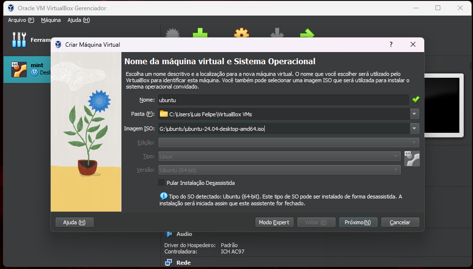
  
- Selecionando ISO:
- 
  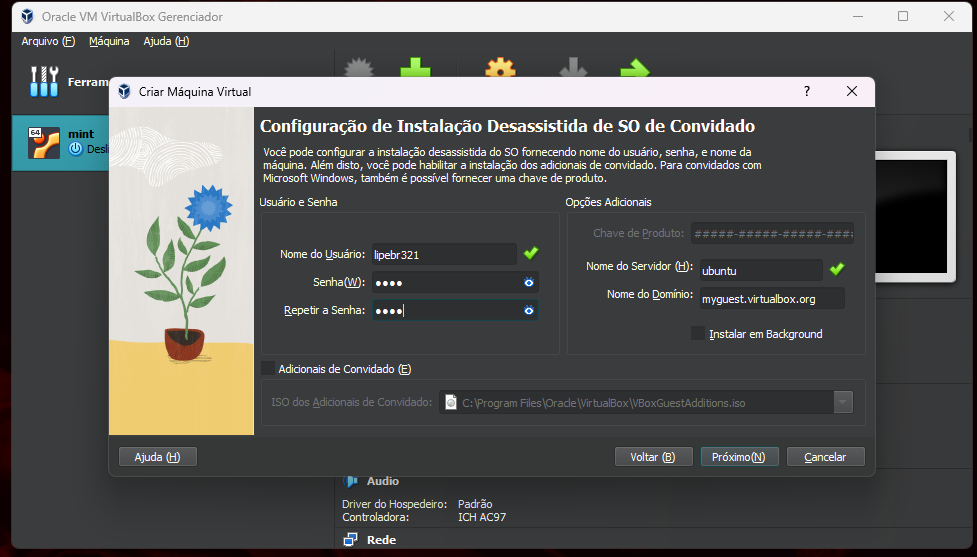
  
- Configurações da VM:
- 
    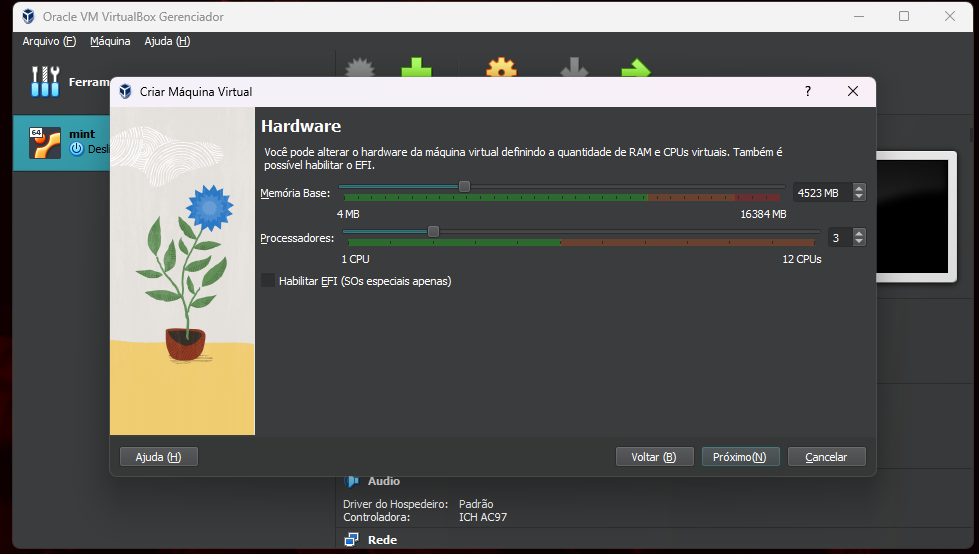
  
  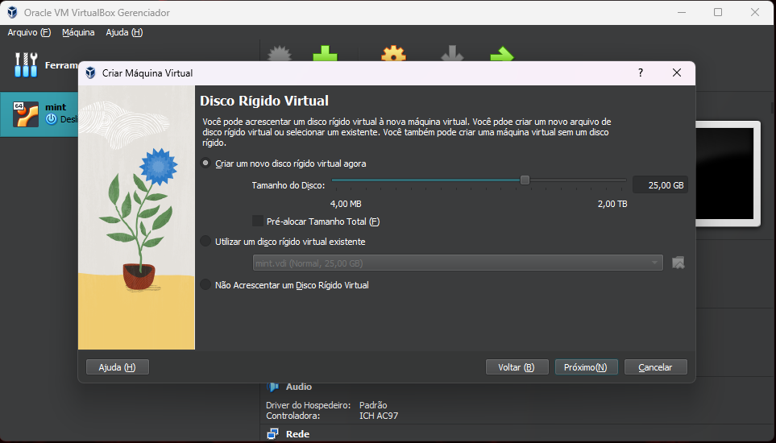
  
    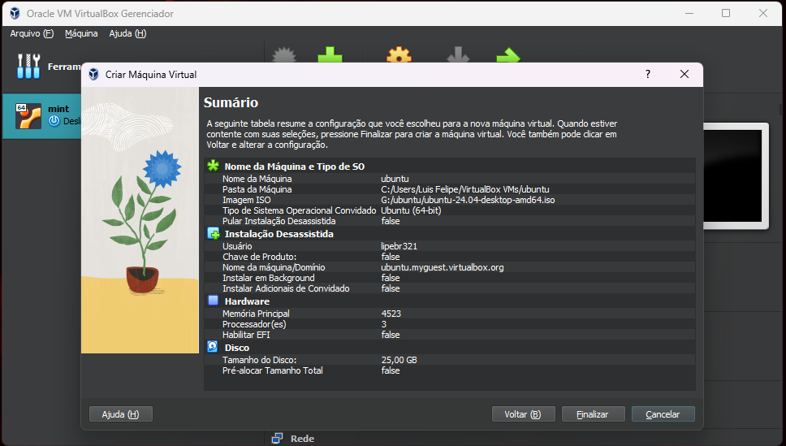
  
- Iniciando a VM:

   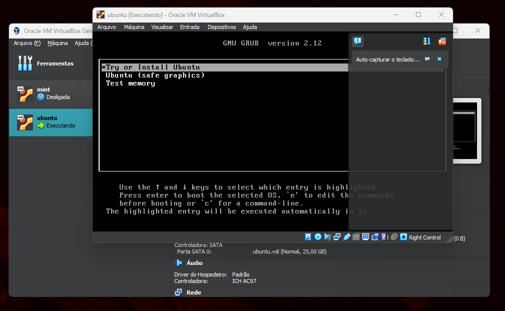

   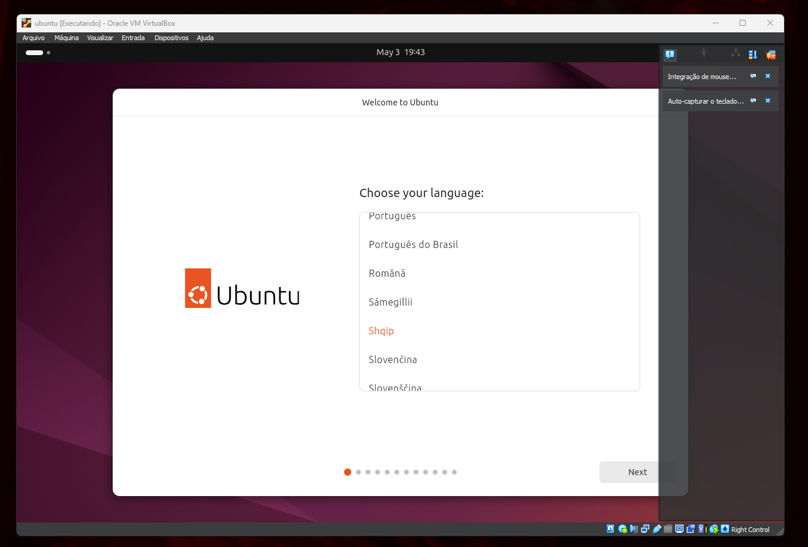
  
### Iniciando a instalação do SO Linux Ubuntu:
- Primeiro acesso ao SO:

     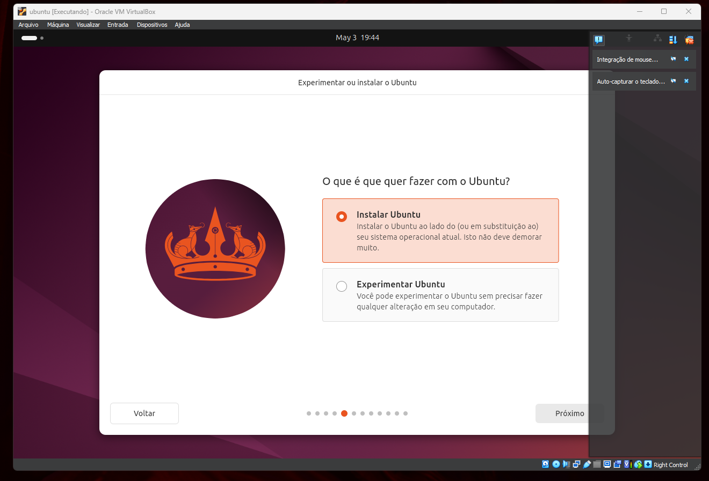

     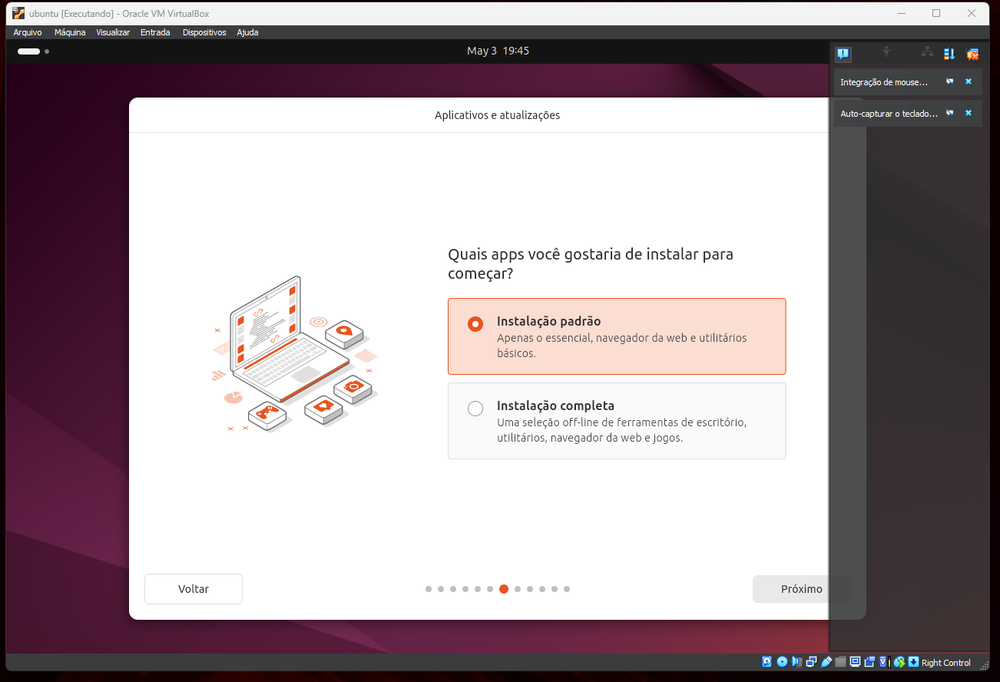
  
     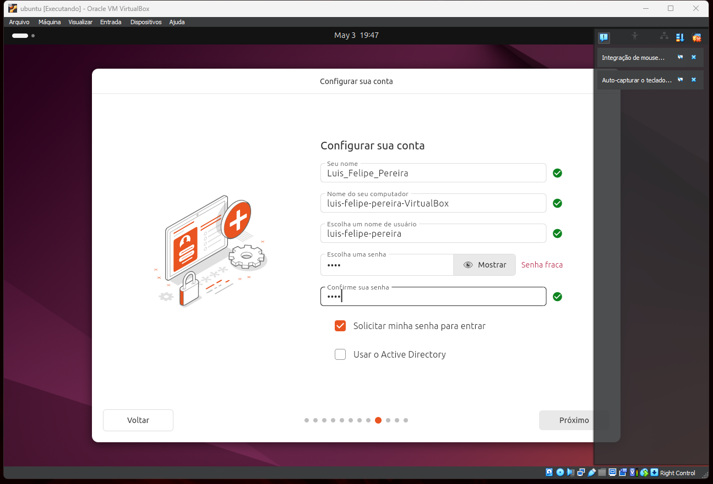
  
     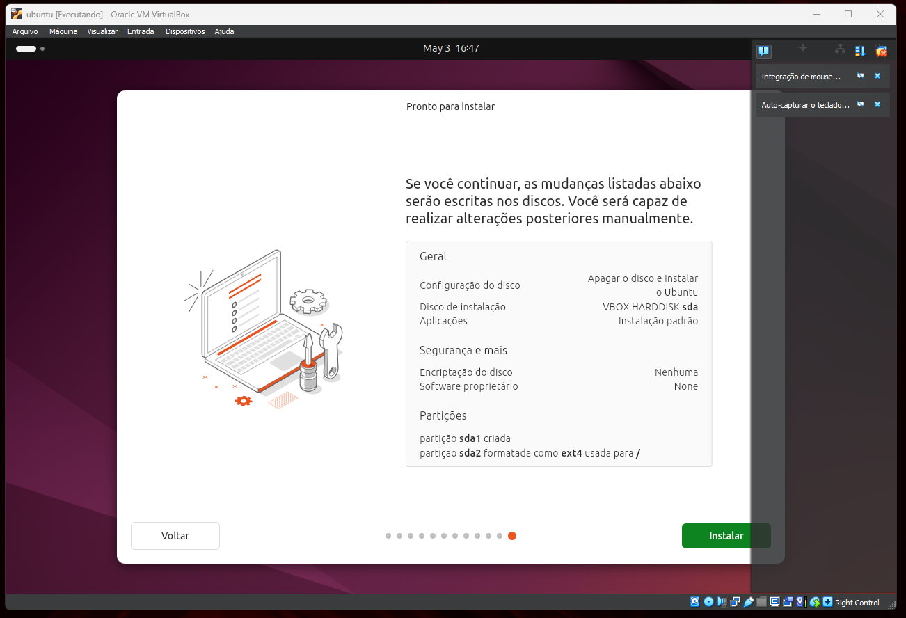

     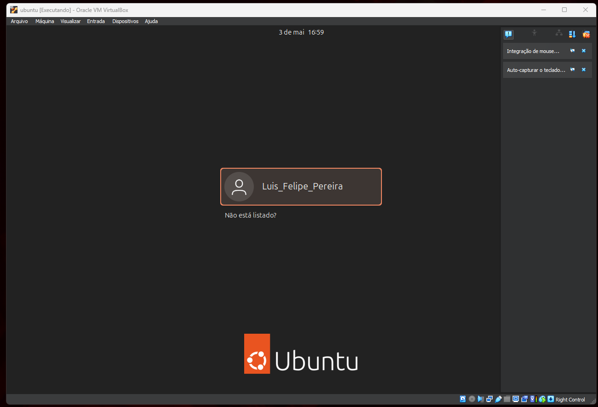

- Criação de Usuário e Senha via terminal acessando o usuário root:
Em seguida, o sistema solicitará a senha para o novo usuário.

### `adduser nome_sobrenome`
Em seguida, o sistema solicitará a senha para o novo usuário.

  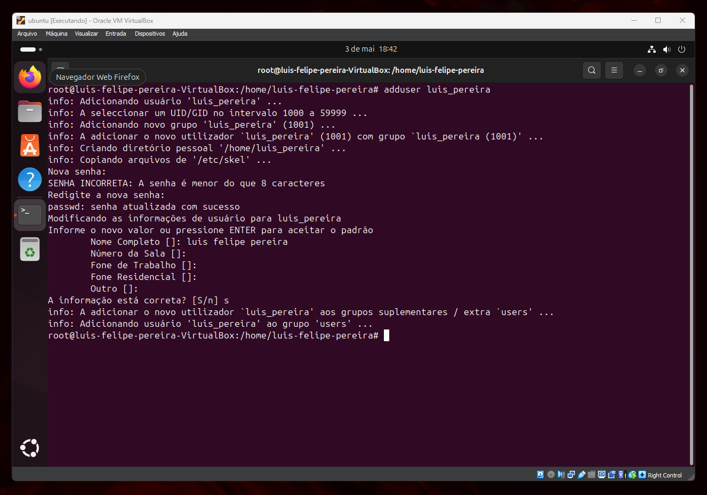
  
### Criação de Diretórios:

- Seguindo a estrutura especificada, realizei as seguintes operações:
- Criei um diretório para armazenar as atividades chamado ATIVIDADES_LABORATORIO.
- Dentro do diretório ATIVIDADES_LABORATORIO, criei outro diretório chamado atividade1.
- Entrei no diretório atividade1.
  
### Manipulação de Arquivos:
- Confirmei se estava dentro do diretório atividade1.
- Criei um arquivo dentro do diretório atividade1 chamado disciplinas_semestre, utilizando o comando:

### Criação de Diretórios:
- Seguindo a estrutura especificada, realizei as seguintes operações:
- Criei um diretório para armazenar as atividades chamado ATIVIDADES_LABORATORIO.
- Dentro do diretório ATIVIDADES_LABORATORIO, criei outro diretório chamado atividade1.
- Entrei no diretório atividade1.

### Manipulação de Arquivos:
- Confirmei se estava dentro do diretório atividade1.
- Criei um arquivo dentro do diretório atividade1 chamado disciplinas_semestre, utilizando o comando:

### `mkdir ATIVIDADES_LABORATORIO

### `cd ATIVIDADES_LABORATORIO`

### `mkdir atividade1`

### `cd atividade1`

### `cat > disciplinas_semestre`

Em seguida, inseri o seguinte conteúdo no arquivo:

-Sistemas Operacionais
-Redes de Computadores
-Análise de Algoritmos
-Gestão de Projetos
-Cálculo Numérico
-Estudos Dirigidos

  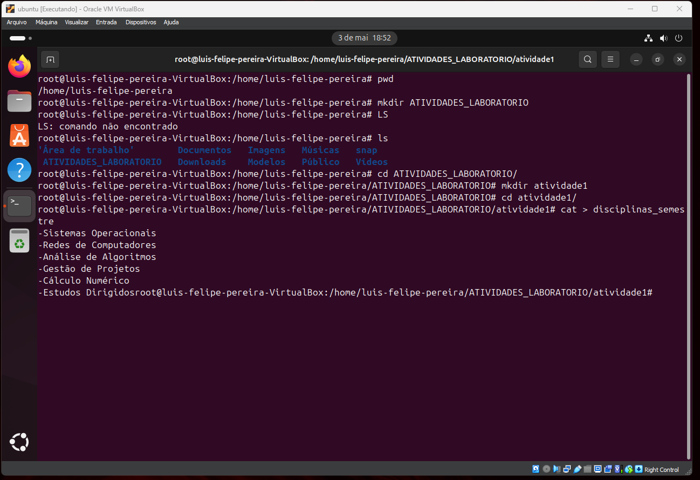

Verifiquei se o arquivo disciplinas_semestre foi criado corretamente.

### `cat disciplinas_semestre`

  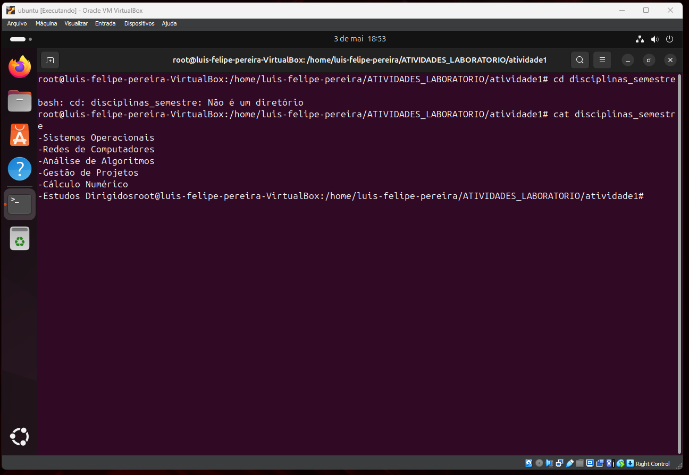

Em seguida, limpei o terminal e exibi na tela o arquivo disciplinas_semestre para verificar se o conteúdo estava correto.

### Operações Básicas no Linux:
- Comandos básicos do Linux:
- ## `help` - Mostra as opções de um aplicativo.
- ## `man` - Exibe o manual de um determinado comando. Para sair do manual, pressionei a tecla 'q'.
- ## `pwd` - Exibe o diretório corrente.
- ## `passwd` - Permite a troca de senha do usuário.
- ## `clear` - Limpa a tela.
- ## `cal` - Exibe o calendário de um mês ou ano.
- ## `who` - Mostra quem está logado no sistema.
- ## `mkdir` - Cria um diretório.
- ## `ls` - Lista nomes dos arquivos.
- ## `cd` - Modifica o diretório corrente.
- ## `cat` - Concatena e mostra o conteúdo do arquivo.

## Conclusão:
A instalação da máquina virtual Linux Ubuntu foi realizada com sucesso, e os procedimentos de criação de usuário, manipulação de diretórios e arquivos, além do uso de comandos básicos do Linux foram executados conforme solicitado. Este exercício foi importante para a familiarização com o ambiente Linux e seus comandos fundamentais.
